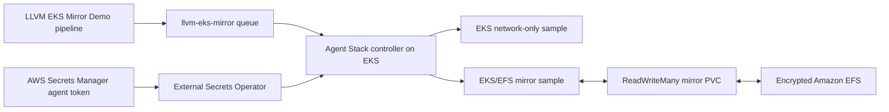

# Self-hosted EKS Git mirror for the LLVM demo

This Terraform stack creates a dedicated two-way LLVM checkout demo in the
Buildkite `Self-Hosted K8s Stack (Demo)` cluster. It adds a new
`llvm-eks-mirror` queue and `LLVM EKS Mirror Demo` pipeline, provisions Amazon
EKS, and installs Buildkite Agent Stack for Kubernetes with a persistent Git
mirror.

The mirror is an encrypted Amazon EFS file system exposed through a
ReadWriteMany PVC. Every ephemeral checkout pod uses Agent Stack's native
`gitMirrors` configuration, so Buildkite manages mirror creation, updates, and
locking. The command container also receives a read-write mount of the same
PVC so the benchmark can report the attached mirror and perform a controlled
reference clone.



## Security model

- Terraform receives only the Secrets Manager ARN. It never reads or stores
  the Buildkite agent token.
- External Secrets uses EKS Pod Identity and a policy scoped to the one secret.
- If the secret uses a customer-managed KMS key, set
  `buildkite_agent_token_kms_key_arn`; decryption is limited to Secrets Manager
  in the configured Region.
- EKS workers run in private subnets. EFS accepts NFS only from the EKS node
  security group.
- The EKS control-plane endpoint is IAM-authenticated. Terraform requires at
  least one restricted operator CIDR and rejects public-internet CIDRs.

## Prerequisites

1. Create or reuse a Buildkite cluster agent token for the **Self-Hosted K8s
   Stack (Demo)** cluster (`46bc07ee-5b9f-4a6f-bdb5-b973cd57d505`). Agent
   tokens are cluster-scoped, so a token from the Hosted Agents cluster will
   not work.
2. Store the token in AWS Secrets Manager in `us-east-1` as JSON with the key
   `BUILDKITE_AGENT_TOKEN`. Use the AWS console or your approved secret
   provisioning workflow; never place the token in a `.tfvars` file.
3. Ensure `aws sts get-caller-identity` succeeds and that the identity can
   create the resources in this stack.
4. Authenticate the Buildkite CLI to `buildkite-solutions`. Terraform reads
   the Buildkite API token from `BUILDKITE_API_TOKEN`.
5. Ensure these repository changes exist on
   `buildkite_pipeline_default_branch` before starting the new pipeline. The
   default is `codex/buildkite-monorepo-demo`.

Terraform grants the Buildkite `Solutions` team initial access to the pipeline.
Override `buildkite_default_team_graphql_id` when another team should own it.

## Deploy

```bash
cd infra/eks-mirror
cp terraform.tfvars.example terraform.tfvars
# Replace the example secret ARN and operator CIDR.

export BUILDKITE_API_TOKEN="$(bk auth token)"
terraform init
terraform plan -out=tfplan
terraform apply tfplan
```

The shell captures the Buildkite API token directly into Terraform's process
environment; it is not written to the repository. The Buildkite agent token
remains in Secrets Manager and is resolved inside EKS.

Configure kubectl and verify the controller:

```bash
aws eks update-kubeconfig --region us-east-1 --name llvm-eks-mirror
kubectl -n buildkite get deployment,pvc,externalsecret
kubectl -n buildkite rollout status deployment/agent-stack-k8s --timeout=5m
```

Then start the Terraform-managed `LLVM EKS Mirror Demo` pipeline with either
checkout-performance profile. The checkout lab runs two parallel samples on
the new `llvm-eks-mirror` queue:

1. direct GitHub network clone without a reference mirror;
2. reference clone using the customer-managed persistent EFS mirror.

The comparison step publishes one annotation with both results. Keeping both
samples on the same Agent Stack, EKS worker group, job image, and queue isolates
the effect of the persistent mirror.

## Lifecycle

The stack uses two on-demand EKS workers, one NAT gateway, the EKS control
plane, and EFS, so it incurs AWS charges while present. When the demo does not
need a warm mirror, remove the stack with `terraform destroy`. Deleting the
PVC removes its EFS access point; Terraform then removes the EFS file system,
EKS cluster, dedicated Buildkite pipeline and queue, and network resources. The
source Secrets Manager secret is external to this stack and is not deleted.

## Upstream references

- [Buildkite Agent Stack installation](https://buildkite.com/docs/agent/self-hosted/agent-stack-k8s/installation)
- [Agent Stack Git mirror settings](https://buildkite.com/docs/agent/self-hosted/agent-stack-k8s/git-settings)
- [Buildkite Terraform queues](https://buildkite.com/docs/platform/terraform-provider/manage-clusters-and-queues)
- [Amazon EFS CSI driver](https://docs.aws.amazon.com/eks/latest/userguide/efs-csi.html)
- [External Secrets AWS provider](https://external-secrets.io/latest/provider/aws-secrets-manager/)
